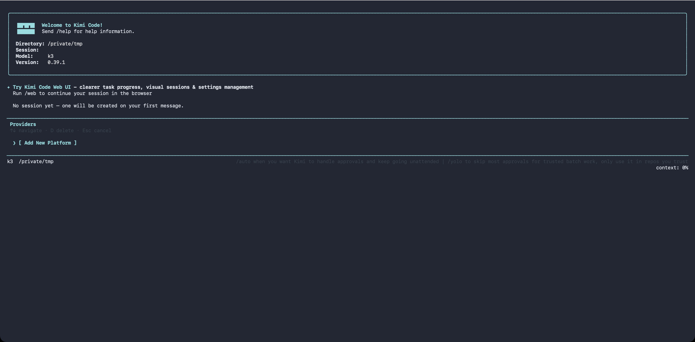

# 平台与模型

Kimi Code CLI 支持同时接入多家模型供应商服务，模型在供应商之上声明自己的名称、上下文长度和能力。本页介绍如何在 `config.toml` 里配置各种供应商。

## 支持的供应商类型

`providers` 表里的 `type` 字段决定使用哪种协议实现：

| 类型 | 协议 | 典型用途 |
| --- | --- | --- |
| [`kimi`](#kimi) | OpenAI 兼容 | Kimi Code 托管服务、Kimi Platform API 密钥 |
| [`anthropic`](#anthropic) | Anthropic Messages | Claude 系列模型 |
| [`openai`](#openai) | OpenAI Chat Completions | OpenAI 及兼容服务、DeepSeek、Qwen 等 |
| [`openai_responses`](#openai_responses) | OpenAI Responses API | OpenAI 较新的 Responses 接口 |
| [`google-genai`](#google-genai) | Google GenAI | Gemini API |
| [`vertexai`](#vertexai) | Google GenAI on Vertex | Google Cloud Vertex AI |

所有供应商默认以流式方式与模型交互。thinking、视觉、工具调用等能力按模型名前缀自动匹配，通常不需要手动声明。

**凭证优先级**：`api_key` 直接字段 > `[providers.<name>.env]` 子表键 > 两者都缺时启动报错。CLI 不会从 shell 环境变量自动取凭证，详见[配置覆盖：供应商凭证](./overrides.md#供应商凭证)。

## `/provider` — 交互式供应商管理

不想手动编辑 TOML？在 TUI 里输入 `/provider` 打开**供应商管理器**，可以以交互方式添加或删除供应商。



管理器按来源把供应商显示为一行行条目。操作方式：

- ↑/↓ 移动光标，←/→ 翻页
- `d` 键删除当前供应商（有 `[y/N]` 确认）
- 在 `[ Add New Platform ]` 行按 Enter 添加新供应商

添加时有两条路径：

- **Known third-party provider**：从 [models.dev](https://models.dev/) 拉取模型目录，选供应商 → 输入 API 密钥 → 选默认模型。目录未声明协议类型的供应商（如 xai、openrouter 这类厂商专用 SDK）会按 OpenAI 兼容协议导入并显示 "guessed" 提示；目录没有可用端点时会先弹出 base URL 输入框；Amazon Bedrock / Cohere 等专有协议和无法识别的显式协议会被拒绝导入。已下线（deprecated）和 alpha 状态的模型不会出现在导入列表中。如果公共目录不可达，CLI 会回退到内置目录快照，离线或网络受限环境下也能完成导入
- **Custom registry (api.json)**：粘贴自定义 registry 地址和 Bearer token，CLI 自动创建 `providers` / `models` 条目。后续启动时，同一个 registry 地址下的供应商会一起刷新，因此上游新增、删除供应商以及模型元数据变化都会同步。

::: warning
通过 `/login` 登录的 Kimi Code OAuth 托管账号不会在 `/provider` 里显示，请用 `/login` 和 `/logout` 管理。
:::

非交互环境下也可以用 shell 命令完成同样操作：[`kimi provider`](../reference/kimi-command.md#kimi-provider)。

## `kimi`

用于对接 Moonshot AI 的 OpenAI 兼容接口，包括 Kimi Code 托管服务和 Kimi Platform API 密钥。

- 默认 `base_url`：`https://api.moonshot.ai/v1`
- 凭证键名：`KIMI_API_KEY`、`KIMI_BASE_URL`
- 额外能力：支持视频上传

```toml
[providers.kimi]
type = "kimi"
base_url = "https://api.moonshot.ai/v1"
api_key = "sk-xxxxx"
```

> 使用 Kimi Code 托管服务时，`/login` 登录后会自动配置 `base_url` 和凭证，无需手动填写。

## `anthropic`

用于对接 Claude API。标准 Claude 模型自动启用视觉、工具调用及 Thinking（如支持）；自定义或未覆盖的模型需在 `[models.<alias>]` 里显式声明 `capabilities`。

- 默认 `base_url`：跟随 Anthropic SDK 默认值
- 凭证键名：`ANTHROPIC_API_KEY`、`ANTHROPIC_BASE_URL`
- 默认 `max_tokens`：按模型自动推断。如需覆盖，在模型别名上设 `max_output_size`

```toml
[providers.anthropic]
type = "anthropic"
api_key = "sk-ant-xxxxx"

[models."claude-opus-4-7"]
provider = "anthropic"
model = "claude-opus-4-7"
max_context_size = 200000
# max_output_size = 32000  # 可选，省略时使用模型推断的默认值
```

## `openai`

用于对接 OpenAI Chat Completions 协议，也可连接任何兼容该协议的第三方服务（覆盖 `base_url` 即可）。

第三方推理模型（DeepSeek、Qwen、One API 等）开箱即用：CLI 自动处理 `reasoning_content` 字段和 `reasoning_effort` 注入。如果你的网关用非标准字段名返回推理内容，在模型别名上设 `reasoning_key` 覆盖。

- 默认 `base_url`：`https://api.openai.com/v1`
- 凭证键名：`OPENAI_API_KEY`、`OPENAI_BASE_URL`

```toml
[providers.openai]
type = "openai"
base_url = "https://api.openai.com/v1"
api_key = "sk-xxxxx"
```

## `openai_responses`

对应 OpenAI 较新的 Responses API，始终以流式方式工作。它支持文本和图片输入、供应商原生压缩，也可以为兼容网关动态写入缓存 header。对于支持图片的模型别名，请在 `capabilities` 中加入 `image_in`；粘贴的图片会作为 Responses `input_image` data URL 发送。

- 默认 `base_url`：`https://api.openai.com/v1`
- 凭证键名：`OPENAI_API_KEY`、`OPENAI_BASE_URL`

```toml
[providers.openai-responses]
type = "openai_responses"
base_url = "https://api.openai.com/v1"
api_key = "YOUR_API_KEY"
```

如果网关通过请求 header 保持会话亲和性，可配置 `cache_key_header`。Kimi Code 会把同一个自动生成的会话值写入该 header 和 Responses API 的 `prompt_cache_key`，不会让所有会话共用一个静态值。

兼容网关还可以通过 `observability_url` 提供安全的会话级账号、配额及缓存汇总数据。Kimi Code 会用相同的会话身份查询这个只读端点，并在 `/usage` 中显示结果；在 `[status_line].items` 中加入 `provider`，即可让账号标签和缓存命中率持续显示在底部状态栏。

如果 Responses 模型支持图片但不支持视频，`ReadMediaFile` 可以把视频分析委派给另一个已配置模型，而不切换主会话模型。在 Responses 供应商上设置 `video_fallback_model` 和 `video_fallback_effort`，再开启 `video-media-fallback`。工具会把实际的视频问题转交给后备模型；图片读取仍由当前 Responses 模型处理。

如需供应商原生压缩，请同时开启实验功能并让供应商显式 opt in。此后 `/compact` 和自动 full compaction 会调用 `POST /responses/compact`，把会话作为 `input`、当前系统提示词作为 `instructions`，并把选定的 Thinking effort 作为 `reasoning` 发送。压缩由该端点自行完成，不需要另外提供摘要提示词。Kimi Code 会把返回的 output 保存为不透明供应商状态，并在下一次 Responses 请求中原样重放。如果任一开关未启用，Kimi Code 会继续走现有的基于提示词的文本压缩路径。

```toml
[experimental]
openai-responses-compaction = true
video-media-fallback = true

[providers.responses-gateway]
type = "openai_responses"
base_url = "https://gateway.example/v1"
api_key = "YOUR_API_KEY"
cache_key_header = "X-Session-ID"
native_compaction = true
observability_url = "https://gateway.example/observability/session"
video_fallback_model = "video-provider/video-model"
video_fallback_effort = "high"

[models."responses-gateway/example-model"]
provider = "responses-gateway"
model = "example-model"
max_context_size = 258000
max_input_size = 258000
capabilities = ["thinking", "tool_use", "image_in"]
support_efforts = ["medium", "high", "xhigh"]
default_effort = "medium"
```

## `google-genai`

用于直连 Google Gemini API。thinking、视觉及多模态能力按模型名自动识别。

- 凭证键名：`GOOGLE_API_KEY`

```toml
[providers.gemini]
type = "google-genai"
api_key = "xxxxx"
```

如需经由兼容 Gemini 协议的代理/网关访问，可设置 `base_url`（或 `GOOGLE_GEMINI_BASE_URL` 环境变量）；不填时使用 SDK 默认地址 `https://generativelanguage.googleapis.com`。

> 只填**主机根地址**。Google GenAI SDK 会自行追加 API 版本与路径（如 `/v1beta/models/<model>:generateContent`），所以结尾带 `/v1beta` 会导致路径重复成 `/v1beta/v1beta/…`。

```toml
[providers.gemini]
type = "google-genai"
api_key = "xxxxx"
base_url = "https://your-gateway.example"
```

## `vertexai`

与 `google-genai` 共用实现，`type = "vertexai"` 时切换到 Vertex AI 访问路径。

认证走 Google Cloud 标准 ADC 流程（`gcloud auth application-default login` 或 `GOOGLE_APPLICATION_CREDENTIALS` 服务账号 JSON），这部分与 Kimi Code 无关。**项目 ID 和区域必须写在 `[providers.vertexai.env]` 子表里**。直接在 shell 里 `export GOOGLE_CLOUD_PROJECT` 不会被 CLI 读取。

```toml
[providers.vertexai]
type = "vertexai"

[providers.vertexai.env]
GOOGLE_CLOUD_PROJECT = "my-gcp-project"
GOOGLE_CLOUD_LOCATION = "us-central1"
```

```sh
gcloud auth application-default login   # 一次性完成认证
kimi
```

如需让 Vertex 请求走自定义（如代理）端点，可设置 `base_url`（或 `GOOGLE_VERTEX_BASE_URL` 环境变量）；不填时使用 SDK 默认的区域化 `*-aiplatform.googleapis.com` 地址。与 `google-genai` 一样，只填主机根地址。SDK 会自行追加 `/v1beta1/publishers/google/models/…`。


## 下一步

- [配置文件](./config-files.md) — `providers` 和 `models` 表的完整字段参考
- [配置覆盖](./overrides.md) — 供应商凭证的解析优先级规则
- [环境变量](./env-vars.md) — 各供应商对应的凭证键名列表
